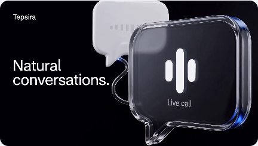
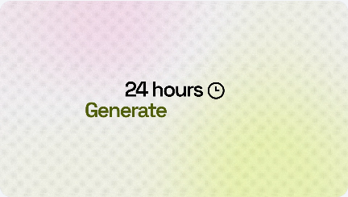
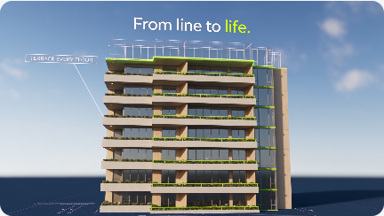
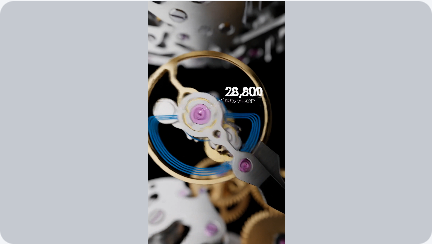
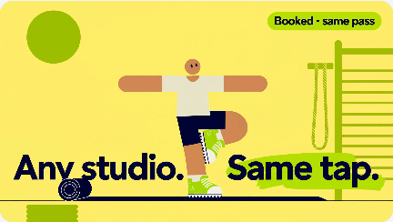
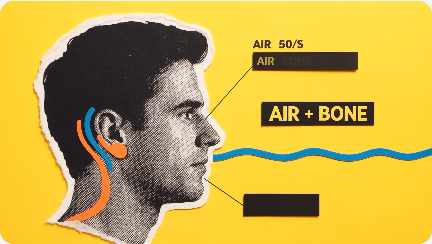
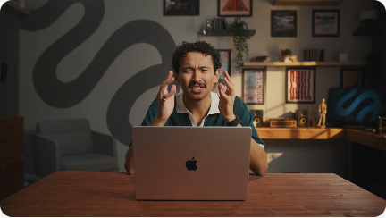
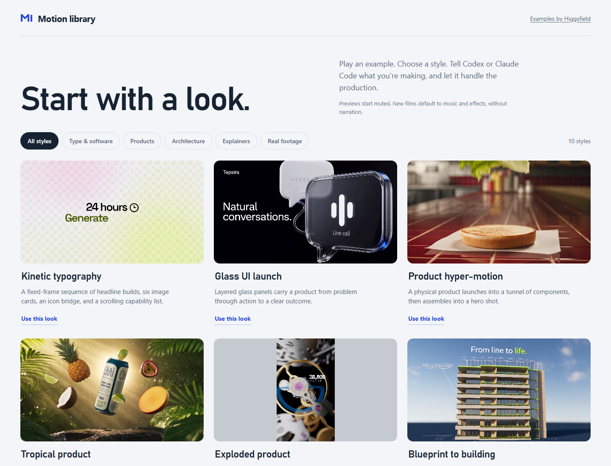

<p align="center">
  <picture>
    <source media="(prefers-color-scheme: dark)" srcset="docs/images/wordmark-dark.svg" />
    
  </picture>
</p>

<p align="center">
  Turn a product, website or idea into a complete motion film.<br />
  Choose a look. Adapt the prompt. Generate with Higgsfield.
</p>

<p align="center">
  <strong>Codex + Claude Code</strong> &nbsp; / &nbsp; 10 motion styles &nbsp; / &nbsp; One shared skill
</p>

<p align="center">
  <a href="#quick-start"><strong>Get started</strong></a> &nbsp; · &nbsp;
  <a href="#the-motion-library">Explore the looks</a> &nbsp; · &nbsp;
  <a href="docs/setup.md">Setup guide</a> &nbsp; · &nbsp;
  <a href="#how-it-works">How it works</a>
</p>

---

## The motion library

From glass interfaces to product reveals, start with a visual direction you can actually watch. **Click any image to play its source film.**

<table>
  <tr>
    <td width="33%" valign="top">
      <a href="https://d2ol7oe51mr4n9.cloudfront.net/user_3DiY2MbHSIvzM3FG2DOgC6Cf2MM/fee13558-1de4-46cb-80c6-443935cb8257.mp4"></a><br />
      <strong>Glass UI launch</strong><br />
      <sub>Software & product launches</sub>
    </td>
    <td width="33%" valign="top">
      <a href="https://d2ol7oe51mr4n9.cloudfront.net/user_3DiY2MbHSIvzM3FG2DOgC6Cf2MM/a95756c8-1f3f-4d93-9ea9-a14832aba4bd.mp4"></a><br />
      <strong>Tropical product</strong><br />
      <sub>Products & ingredients</sub>
    </td>
    <td width="33%" valign="top">
      <a href="https://d2ol7oe51mr4n9.cloudfront.net/user_3DiY2MbHSIvzM3FG2DOgC6Cf2MM/75a6c434-a18a-4484-81b0-387308743279.mp4"></a><br />
      <strong>Kinetic typography</strong><br />
      <sub>Announcements & animated type</sub>
    </td>
  </tr>
  <tr>
    <td width="33%" valign="top">
      <a href="https://d2ol7oe51mr4n9.cloudfront.net/user_3DiY2MbHSIvzM3FG2DOgC6Cf2MM/4e68af0a-c12e-4dd2-9f69-3b523e534ee4.mp4"></a><br />
      <strong>Blueprint to building</strong><br />
      <sub>Architecture & property</sub>
    </td>
    <td width="33%" valign="top">
      <a href="https://d2ol7oe51mr4n9.cloudfront.net/user_3DiY2MbHSIvzM3FG2DOgC6Cf2MM/9eb4a7a5-d79c-459a-8a8d-593e912aa7a3.mp4"></a><br />
      <strong>Exploded product</strong><br />
      <sub>Hardware & component reveals</sub>
    </td>
    <td width="33%" valign="top">
      <a href="https://d2ol7oe51mr4n9.cloudfront.net/user_3DiY2MbHSIvzM3FG2DOgC6Cf2MM/eda55630-7def-48c7-b4a8-f73e6022b653.mp4"></a><br />
      <strong>Flat vector explainer</strong><br />
      <sub>Apps & simple explanations</sub>
    </td>
  </tr>
</table>

<details>
<summary><strong>Explore four more styles</strong> — hyper-motion, hybrid 2D + 3D, collage and footage</summary>

<table>
  <tr>
    <td width="50%" valign="top">
      <a href="https://d2ol7oe51mr4n9.cloudfront.net/user_3DiY2MbHSIvzM3FG2DOgC6Cf2MM/d1e752b7-ea6b-4553-98c6-15c8f3bf0cb4.mp4"></a><br />
      <strong>Product hyper-motion</strong><br />
      <sub>Food & product assembly</sub>
    </td>
    <td width="50%" valign="top">
      <a href="https://d2ol7oe51mr4n9.cloudfront.net/user_3DiY2MbHSIvzM3FG2DOgC6Cf2MM/4d56be98-74fb-4616-9269-db37ea998171.mp4"></a><br />
      <strong>Hybrid 2D + 3D</strong><br />
      <sub>Playful brand stories</sub>
    </td>
  </tr>
  <tr>
    <td width="50%" valign="top">
      <a href="https://d2ol7oe51mr4n9.cloudfront.net/user_3DiY2MbHSIvzM3FG2DOgC6Cf2MM/61a1f7e8-0a71-4f07-87de-8c75b4c69c34.mp4"></a><br />
      <strong>Editorial collage</strong><br />
      <sub>Ideas & educational shorts</sub>
    </td>
    <td width="50%" valign="top">
      <a href="https://d2ol7oe51mr4n9.cloudfront.net/user_3DiY2MbHSIvzM3FG2DOgC6Cf2MM/d94bfad5-165f-4c27-ba85-bd169b1e3408.mp4"></a><br />
      <strong>Footage + graphics</strong><br />
      <sub>Presenters & existing footage</sub>
    </td>
  </tr>
</table>

</details>

<sub>These are Higgsfield source examples that the skill adapts, not new results generated by this package. <a href="ATTRIBUTION.md">Source attribution</a>.</sub>

**[Open the playable gallery locally](docs/setup.md#4-browse-the-playable-gallery)** to browse all ten styles, inspect their original prompts and copy a request for your app. You can also develop an original concept.

<details>
<summary>Inside the gallery</summary>



Choose a look, select Codex or Claude Code, add your brief and copy the request into chat. The page does not send your brief or start a generation. GitHub shows the gallery HTML as source; the [setup guide](docs/setup.md#4-browse-the-playable-gallery) explains how to open it locally.

</details>

## Quick start

Install the same skill in either app, then connect your own Higgsfield account for media generation. Browsing and prompt drafting work before you connect.

### Codex

Paste into Codex:

```text
$skill-installer

Install the skill from:
https://github.com/cth9191/motion-design/tree/main/skills/motion-design
```

### Claude Code

Paste into Claude Code:

```text
Install the skill from https://github.com/cth9191/motion-design.
Copy skills/motion-design into ~/.claude/skills/motion-design.
If it already exists, compare it, back up local customizations, and update it.
```

**[Connect Higgsfield](docs/setup.md#2-connect-higgsfield)** using the setup guide. It includes Claude Code's MCP command, authentication and a read-only access check. Generation requires model access and credits or an applicable allowance.

### Make your first film

Start with **`$motion-design`** in Codex or **`/motion-design`** in Claude Code, then add:

```text
Use the kinetic typography preset for a 15-second announcement:
"Build your first AI workflow."
Use music and synchronized effects, without narration.
Show me the complete adapted prompt before generating anything.
```

Review the draft, then ask it to generate. A prompt-review request stops before images, uploads and video jobs; production can incur Higgsfield charges.

<details>
<summary><strong>More things to try</strong> — a website promo, an explainer or a product film</summary>

**Browse first**

```text
Show me the available motion-graphics styles with playable examples.
```

**Turn a website into a launch concept**

```text
Use the website I provide to propose a 15-second promo.
Choose a suitable preset and focus on one main product benefit.
Show me the complete adapted prompt before generating anything.
```

**Explain one idea**

```text
Use the flat vector explainer preset for a beginner-friendly,
15-second explanation of how an LLM generates an answer.
Use music and synchronized effects without narration.
Show me the full adapted prompt before generating anything.
```

**Create a product film**

```text
Use the tropical product preset to make a 15-second film for the
product photo I attach. Keep its packaging recognizable.
Use instrumental music and sound effects, with no narration.
Generate the complete film and inspect the result.
```

You can also ask for reference images alone. Requesting images does not commission a video.

</details>

## How it works

**Choose → Adapt → Generate → Review**

The skill starts from the closest example's **complete original prompt** and the takeaway your viewer should leave with. It retains the source's effective visual and motion techniques while adapting scenes, sequence, timing and transitions to your subject. The resolved timed sequence is submitted as **one complete film** through Higgsfield MCP.

**Bring your own video:** a supplied clip defaults to close recreation. Its sequence, framing, timing and camera moves guide the result; the skill fits your message into those existing beats. For copy and branding changes it checks whole-video editing first, then compares the result against the actual source. Ask for loose inspiration when you want more freedom. See [video references](skills/motion-design/references/video-reference.md).

References are optional. A product photo can help preserve identity; a style frame can clarify appearance. Typography or abstract motion may need no images. After generation, the assistant checks the actual motion, product relevance, exact copy, audio and ending, then identifies any corrections needed.

| | Codex | Claude Code |
| --- | --- | --- |
| **Reference images** | Built-in image generation when available; Higgsfield fallback | Higgsfield MCP, preferring **GPT Image 2** |
| **Complete film** | Higgsfield MCP, suitable current **Seedance** preferred | Same |
| **Prompt-only work** | No generation connection required | Same |

New campaigns generally target **15 seconds · 16:9 · music + effects**, without narration, and a 30fps delivery. Native fps and supported durations depend on the model. Portrait product and supplied-footage presets have their own starting settings; your choices take precedence. See [tool routing](skills/motion-design/references/tool-routing.md) for live model checks and asset handoff.

## Under the hood

The package includes ten source examples, archived prompts with verified hashes, separate adaptation guides, a playable gallery and production review guidance. Both apps use the same skill folder.

<details>
<summary><strong>Project status & validation</strong></summary>

The shared workflow is implemented; source catalog and templates remain version 4. Package checks and connection discovery do not establish creative reliability across all ten styles. The [validation plan](ROADMAP.md) separates implemented work from film trials and reference comparisons still needed.

Exact typography, charts, timing and product identity require output inspection. Supported finishing can repair some problems; automatic pixel-exact compositing and deterministic reproduction of Marketing Studio are not promised. GPT Image 2 was observed as `gpt_image_2` in the connected catalog on September 5, 2026; the skill checks current availability and capabilities before use.

</details>

<details>
<summary><strong>Maintain or update the skill</strong></summary>

Edit `skills/motion-design/`, then rebuild:

```sh
python skills/motion-design/scripts/build_gallery.py
```

Python 3.10+ is needed only for the builder or serving the gallery. The builder checks preset IDs, linked recipes/templates, timeline coverage and archived source hashes, then refreshes the gallery and index. Commit generated changes with source edits; GitHub Actions repeats the check.

Keep original source prompts immutable. Update adaptation guides and workflow instructions for behavior changes. The catalog/template version tracks the source library; README and host-routing edits do not rewrite its provenance. Installed copies are separate from the repo: update the complete skill folder, including references and gallery, and preserve local customizations.

</details>

---
